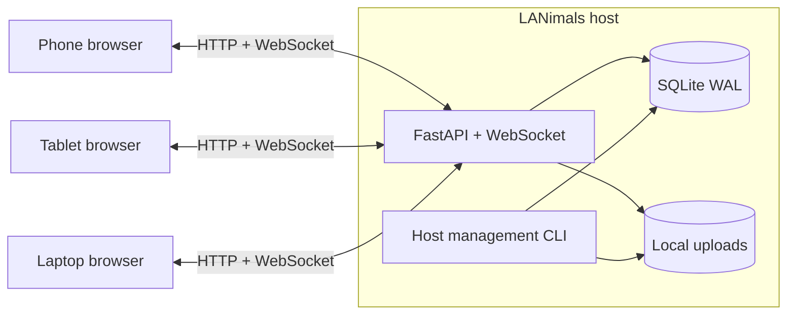

<div align="center">
  <h1>🐱</h1>
  <h1>LANimals</h1>
  <p><strong>One host. One room. Every device on your local network.</strong></p>
  <p>A lightweight browser chat for sending messages and files across phones, tablets, and computers without a cloud service.</p>

  <p>
    
    
    
    
    
    
  </p>

  <p>
    <strong>English</strong> · <a href="README.zh-CN.md">简体中文</a>
  </p>
</div>

---

LANimals runs on one computer inside your LAN. Everyone else joins from a browser, enters the shared room password, and can immediately exchange text and files. Conversation history survives restarts because the host keeps the SQLite database and uploads locally.

If LocalSend handles a one-off transfer, LANimals keeps the conversation around it.

## Product preview

These screenshots come from the real application running against a temporary preview database. The desktop view uses the light theme; the phone view follows the system dark theme.

<table>
  <tr>
    <td width="68%"><a href="docs/assets/lanimals-desktop-light.png"></a></td>
    <td width="32%"><a href="docs/assets/lanimals-mobile-dark.png"></a></td>
  </tr>
  <tr>
    <td align="center">Desktop · light</td>
    <td align="center">Mobile · dark</td>
  </tr>
</table>

## What it does

- **One shared room** — no accounts, channels, contact lists, or setup on client devices.
- **Messages and files together** — send text, one or more attachments, or both in the same message.
- **Persistent local history** — SQLite stores messages and attachment metadata; uploaded files stay on the host disk.
- **Realtime updates** — WebSocket delivery keeps every open browser in sync.
- **Friendly device identities** — regular browsers keep a cute animal name; temporary sessions use a separate mysterious-animal identity.
- **Browser-only clients** — phones and tablets do not need an app.
- **Automatic light and dark themes** — the interface follows `prefers-color-scheme` and falls back to light mode.
- **English and Simplified Chinese** — the browser language selects the initial interface language, with English as the fallback.
- **Host-only administration** — password changes, storage limits, and destructive cleanup stay in the local terminal.
- **No cloud dependency at runtime** — the application uses no CDN, analytics, telemetry, advertising, or remote storage.

## How it works



The host automatically looks for a private RFC1918 address (`10.x`, `172.16-31.x`, or `192.168.x`). If it cannot find one, it binds to `127.0.0.1` instead of exposing the service on an unknown interface. When available, LANimals advertises `lanimals.local` over mDNS and prints a join QR code in the terminal.

## Quick start

### Linux / macOS

```bash
git clone https://github.com/sleepyquq/LANimals.git
cd LANimals

python3 -m venv .venv
.venv/bin/python -m pip install -r requirements.txt
.venv/bin/python -m lanimals
```

### Windows PowerShell

```powershell
git clone https://github.com/sleepyquq/LANimals.git
cd LANimals

py -3.11 -m venv .venv
.\.venv\Scripts\python.exe -m pip install -r requirements.txt
.\.venv\Scripts\python.exe -m lanimals
```

On the first run, LANimals asks you to create the shared room password. Choose option **1** in the host menu to start the chat. The terminal then prints a join address and QR code, for example:

```text
http://lanimals.local:8787/
http://192.168.x.x:8787/
```

Open that address from any device on the same LAN. On Windows, allow Python through the firewall for **private networks only**.

## Host management

Run the menu again from the machine that stores the data.

Linux / macOS:

```bash
.venv/bin/python -m lanimals
```

Windows PowerShell:

```powershell
.\.venv\Scripts\python.exe -m lanimals
```

Direct commands are also available. The examples below use the Linux/macOS interpreter path; on Windows PowerShell, replace `.venv/bin/python` with `.\.venv\Scripts\python.exe`.

```bash
# Start the chat service
.venv/bin/python -m lanimals serve

# Change the shared password and revoke current sessions
.venv/bin/python -m lanimals password

# Change the upload limit
.venv/bin/python -m lanimals config --max-upload-size 2GB

# Delete all messages and uploaded files after local confirmation
.venv/bin/python -m lanimals clear
```

The web interface has no delete route, hidden admin panel, or remote cleanup button.

## Data and backups

All runtime data lives under `data/` by default:

```text
data/
├── config.toml    # host, port, upload limit, and scrypt password hash
├── chat.db        # identities, sessions, messages, and attachment metadata
└── uploads/       # uploaded file contents
```

Stop LANimals and copy the complete `data/` directory to make a consistent backup. The directory is ignored by Git and should never be committed.

## Security model

LANimals is intended for a trusted home or office LAN. It uses ordinary HTTP by default, so it does not protect traffic from other untrusted devices on the same network and should not be exposed directly to the public Internet.

Within that boundary, LANimals keeps several controls explicit:

- room passwords are stored as scrypt hashes;
- session and identity cookies are opaque and `HttpOnly`;
- uploads are authenticated and size-checked before multipart parsing;
- downloads require an authenticated session;
- password rotation invalidates current sessions; connected WebSockets are closed before they can receive a later broadcast;
- destructive administration is available only from the host terminal;
- automatic network binding accepts private LAN addresses only.

## Project layout

```text
lanimals/
├── __main__.py       # management menu and command-line entry point
├── cli.py            # host-only administration
├── config.py         # TOML settings and password hashing
├── identity.py       # cookies, sessions, and animal names
├── limits.py         # pre-parser upload guards
├── main.py           # FastAPI routes and file handling
├── network.py        # LAN discovery, mDNS, and terminal QR code
├── realtime.py       # WebSocket fan-out
├── store.py          # SQLite persistence
└── web/              # native HTML, CSS, JavaScript, and locale files

tests/                # pytest suite
data/                 # local runtime data; ignored by Git
```

## Development

```bash
python3 -m venv .venv
.venv/bin/python -m pip install -r requirements.txt
.venv/bin/python -m pytest -q
.venv/bin/python -m compileall -q lanimals tests
node --check lanimals/web/app.js
```

The frontend intentionally has no build step. Static HTML, CSS, JavaScript, and locale JSON files are packaged with the Python application.

## Current scope

LANimals is built for households and small offices. It currently has one room and does not provide public hosting, private messages, multiple channels, user accounts, message editing, per-message deletion, media transcoding, or multi-worker deployment.
