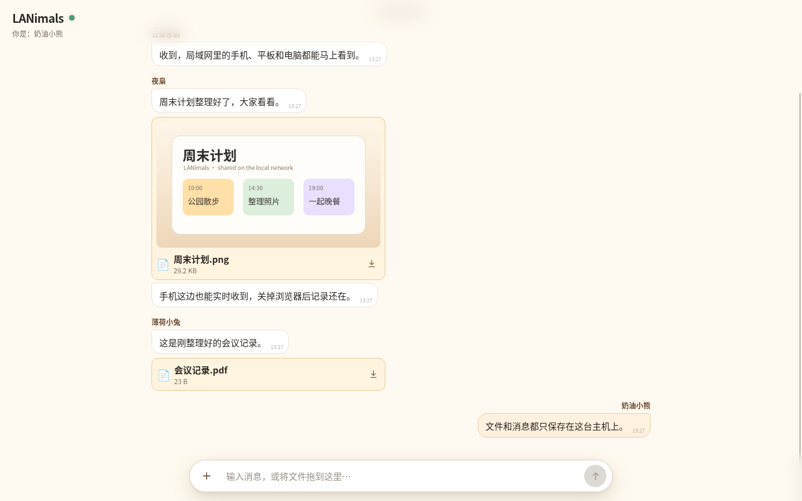
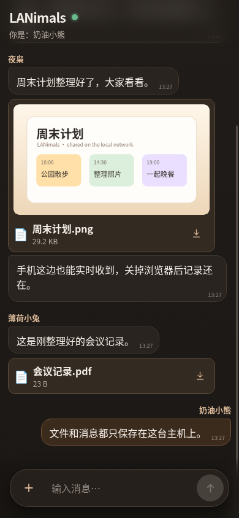
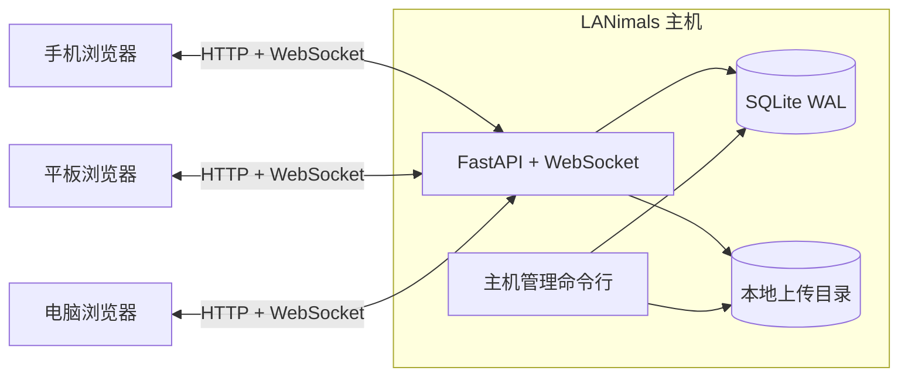

<div align="center">
  
  <h1>LANimals</h1>
  <p><strong>一台主机，一个房间，连接局域网里的所有设备。</strong></p>
  <p>无需云服务，在手机、平板和电脑之间持续发送消息与文件的轻量浏览器聊天室。</p>

  <p>
    
    
    
    
    
    
  </p>

  <p>
    <a href="README.md">English</a> · <strong>简体中文</strong>
  </p>
</div>

---

LANimals 在局域网内的一台电脑上运行。其他设备打开浏览器、输入共享房间密码，就可以立即发送文字和文件。主机本地保存 SQLite 数据库和上传文件，服务重启后聊天记录仍然存在。

如果 LocalSend 适合一次性传输文件，LANimals 则保留文件前后的对话。

## 产品预览

以下截图来自真实运行的 LANimals，数据由临时预览数据库生成。电脑端使用浅色主题，手机端跟随系统深色主题。

<table>
  <tr>
    <td width="68%"><a href="docs/assets/lanimals-desktop-light.png"></a></td>
    <td width="32%"><a href="docs/assets/lanimals-mobile-dark.png"></a></td>
  </tr>
  <tr>
    <td align="center">电脑端 · 浅色</td>
    <td align="center">手机端 · 深色</td>
  </tr>
</table>

## 功能

- **单一共享房间**：没有账号、频道、联系人或客户端配置。
- **消息与文件一起发送**：支持纯文字、多个附件，以及文字和附件组合消息。
- **本地持久化历史**：SQLite 保存消息和附件元数据，文件内容保存在主机磁盘。
- **实时同步**：WebSocket 让所有已打开的浏览器立即看到新消息。
- **可爱动物身份**：普通浏览器长期保留动物名称；临时模式使用独立的神秘动物身份。
- **客户端只需浏览器**：手机和平板无需安装 App。
- **自动浅色与深色主题**：界面读取 `prefers-color-scheme`，无法读取时回退为浅色。
- **简体中文与英文**：首次打开时根据浏览器语言选择界面，不支持的语言回退到英文。
- **管理操作只在主机上执行**：修改密码、上传上限和清空数据都留在本地终端。
- **应用运行时不依赖云服务**：程序运行期间不使用 CDN、统计、遥测、广告或远程存储。

## 工作方式



主机会自动寻找 RFC1918 私有地址（`10.x`、`172.16-31.x` 或 `192.168.x`）。如果找不到，它只绑定 `127.0.0.1`，不会监听未知网络接口。条件允许时，LANimals 会通过 mDNS 广播 `lanimals.local`，并在终端打印加入二维码。

## 快速开始

### Linux / macOS

```bash
git clone https://github.com/sleepyquq/LANimals.git
cd LANimals

python3 -m venv .venv
.venv/bin/python -m pip install -r requirements.txt
.venv/bin/python -m lanimals
```

### Windows PowerShell

```powershell
git clone https://github.com/sleepyquq/LANimals.git
cd LANimals

py -3.11 -m venv .venv
.\.venv\Scripts\python.exe -m pip install -r requirements.txt
.\.venv\Scripts\python.exe -m lanimals
```

首次运行时，LANimals 会要求创建共享房间密码。在主机菜单中选择 **“启动聊天室”**，终端随后会显示加入地址和二维码，例如：

```text
推荐访问: http://lanimals.local:8787/
备用地址: http://192.168.x.x:8787/
```

同一局域网内的设备打开该地址即可加入。Windows 第一次弹出防火墙提示时，只允许 Python 在**专用网络**中通信。

## 主机管理

在保存数据的电脑上再次运行菜单。

Linux / macOS：

```bash
.venv/bin/python -m lanimals
```

Windows PowerShell：

```powershell
.\.venv\Scripts\python.exe -m lanimals
```

也可以直接使用子命令。下面的示例采用 Linux/macOS 路径；在 Windows PowerShell 中，把 `.venv/bin/python` 替换为 `.\.venv\Scripts\python.exe`。

```bash
# 启动聊天室
.venv/bin/python -m lanimals serve

# 修改共享密码并撤销当前会话
.venv/bin/python -m lanimals password

# 修改上传大小上限
.venv/bin/python -m lanimals config --max-upload-size 2GB

# 本地确认后删除全部消息和上传文件
.venv/bin/python -m lanimals clear
```

网页端没有删除接口、隐藏管理面板或远程清空按钮。

## 数据与备份

运行数据默认保存在 `data/`：

```text
data/
├── config.toml    # 主机、端口、上传上限与 scrypt 密码哈希
├── chat.db        # 身份、会话、消息与附件元数据
└── uploads/       # 实际上传文件
```

停止 LANimals 后，复制完整的 `data/` 目录即可获得一致的备份。该目录已被 Git 忽略，不能提交到仓库。

## 安全边界

LANimals 面向可信任的家庭或办公局域网。默认使用普通 HTTP，因此无法防止同一网络内其他不可信设备窃听流量，也不应直接暴露到公网。

在这个边界内，LANimals 明确执行以下控制：

- 共享密码只保存为 scrypt 哈希；
- 会话与身份 Cookie 是不透明随机值，并设置 `HttpOnly`；
- 上传在 multipart 解析前完成身份与原始请求大小检查；
- 下载文件需要有效会话；
- 修改密码会使当前会话失效；已连接的 WebSocket 会在收到后续广播前被关闭；
- 破坏性管理操作只存在于主机本地终端；
- 自动网络绑定只接受私有局域网地址。

## 项目结构

```text
lanimals/
├── __main__.py       # 管理菜单与命令行入口
├── cli.py            # 主机本地管理
├── config.py         # TOML 配置与密码哈希
├── identity.py       # Cookie、会话与动物名称
├── limits.py         # multipart 解析前的上传保护
├── main.py           # FastAPI 路由与文件处理
├── network.py        # 局域网发现、mDNS 与终端二维码
├── realtime.py       # WebSocket 广播
├── store.py          # SQLite 持久化
└── web/              # 原生 HTML、CSS、JavaScript 与语言资源

tests/                # pytest 测试
data/                 # 本地运行数据；Git 已忽略
```

## 开发与测试

```bash
python3 -m venv .venv
.venv/bin/python -m pip install -r requirements.txt
.venv/bin/python -m pytest -q
.venv/bin/python -m compileall -q lanimals tests
node --check lanimals/web/app.js
```

前端刻意不设置构建步骤。原生 HTML、CSS、JavaScript 和语言 JSON 文件会随 Python 包一起发布。

## 当前范围

LANimals 面向家庭和小型办公室。目前只提供一个共享房间，不提供公网托管、私聊、多频道、用户账号、消息编辑、逐条删除、媒体转码或多进程 Worker 部署。
